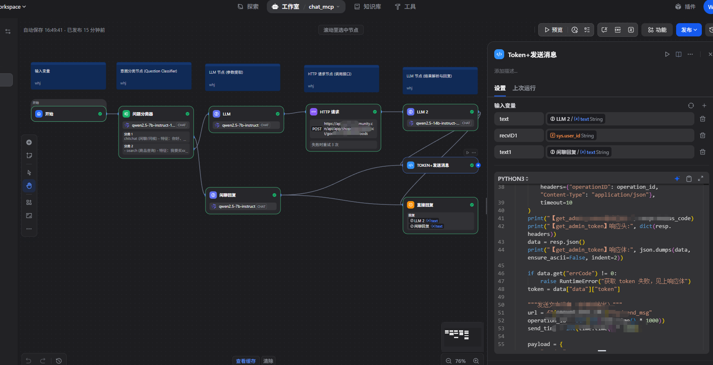
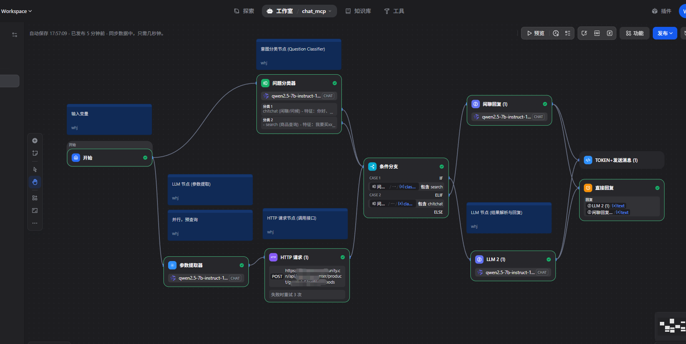
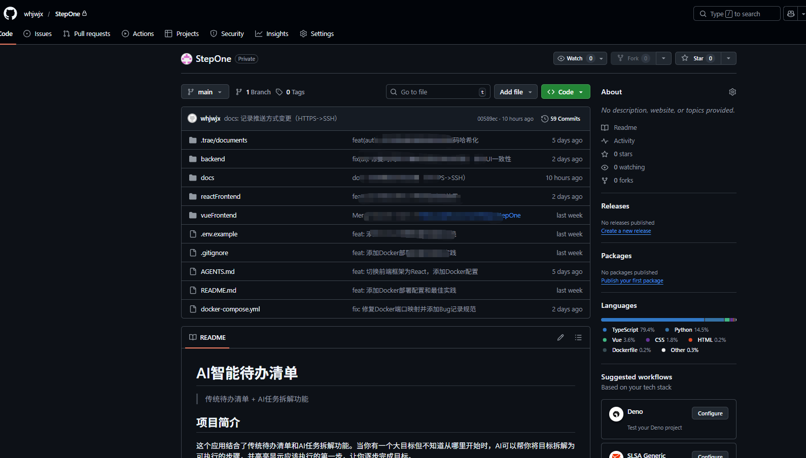
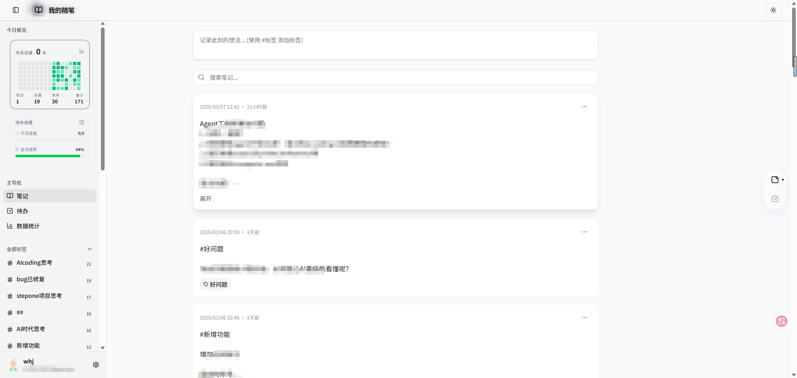
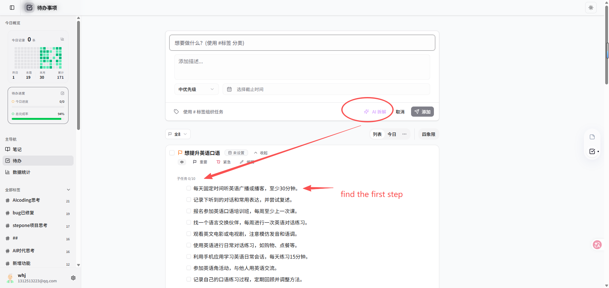
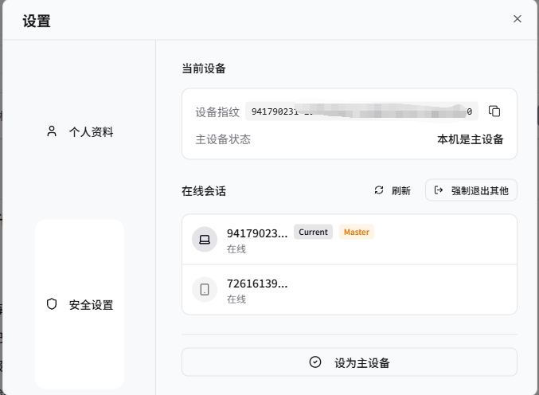
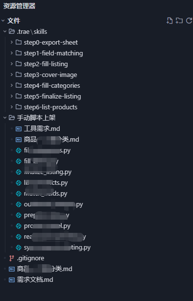

# 🤖 AI-Native Developer Showcase

  
  
  

本仓库是一个**实战驱动**的 AI 协同开发展示空间，旨在记录和分享我在与 AI（Trae国际版, OpenCode, ClaudeCode, Gemni）深度共生过程中的工程实践、效能数据及方法论沉淀。

---

## 👨‍💻 关于作者

我是 **王华江**，一名专注于 **AI 全栈开发与 Agentic 架构** 的技术探索者。

- 🌐 **个人主页**：[huajiang.wang 🔗](https://huajiang.wang) (博客建设中...)
- 🎓 **学历背景**：27届硕士研究生
- 🎯 **求职意向**：前端/全栈开发 (侧重 AI 应用落地)
- 🛠 **技术栈**：
  - **前端**：Vue 3, React 18, 微信小程序, Tailwind CSS
  - **后端**： Python (FastAPI, Flask), Node.js, Java (Spring Boot), PostgreSQL, MySQL
  - **AI 领域**：Dify, MCP (Model Context Protocol), LangChain, RAG, Agentic Workflow
- 💡 **探索实践**：目前正深入研究 [**MCP 生态** 🖱️](#5-效率工具与-mcp-插件-扩展展示)、**自定义 Skills 开发** 以及 **OpenClaw 协同模式**，致力于构建更智能、更自动化的开发工作流。
- 🚀 **核心优势**：擅长将 AI 技术与具体业务场景（如 [**智能导购** 🖱️](#3-dify-智能导购助手优化-workflow-架构)、[**自动化办公** 🖱️](#5-效率工具与-mcp-插件-扩展展示)）深度结合，追求“AI 原生”的开发体验。

---

## 🎯 仓库初衷：为什么要建立这个 Showcase？

在 AI 浪潮下，**开发者正在从“写代码的人”转变为“调优代码的人”**。建立本仓库的初衷有三：
1. **量化 AI 效能**：通过真实数据证明 AI 对开发效率的提升。
2. **沉淀方法论**：总结如何通过精准的 Prompt 和 Context 管理，让 AI 输出工业级代码。
3. **展示工程品味**：即使在 AI 高频产出的背景下，依然坚持原子化提交、模块化封装及高标准脱敏规范。

---

## 📖 目录 (Table of Contents)

- [🚀 AI 协同效能概览 🖱️](#-ai-协同效能概览)
  - [1. 开发效率提升 🖱️](#1-开发效率提升)
  - [2. 编程报告示例 🖱️](#2-编程报告示例)
- [🛠 AI 协同实战展示 🖱️](#-ai-协同实战展示)
  - [1. 复杂逻辑拆解 (Trae Builder Mode) 🖱️](#1-复杂逻辑拆解-trae-builder-mode)
  - [2. 原子化提交规范 (Atomic Commits) 🖱️](#2-原子化提交规范-atomic-commits)
  - [3. Dify 智能导购助手优化 (Workflow 架构) 🖱️](#3-dify-智能导购助手优化-workflow-架构)
  - [4. AI 全栈实战：StepOne (核心展示) 🖱️](#4-ai-全栈实战stepone-核心展示)
  - [5. 效率工具与 MCP 插件 (扩展展示) 🖱️](#5-效率工具与-mcp-插件-扩展展示)
- [📈 自动化研究：Smart Listing Agent 🖱️](#-自动化研究ai-驱动的商品自动上架系统-smart-listing-agent)
- [📂 规范指南 🖱️](#-规范指南)
- [🔗 联系方式 🖱️](#-联系方式)

---

## 🚀 AI 协同效能概览

### 1. 开发效率提升
- **核心功能交付：** 通过 AI 辅助重构与逻辑拆解，平均交付周期缩短约 **40%**。
- **代码生成比：** 在新功能开发中，AI 生成代码占比约 **60%-70%**，人工主要负责核心架构设计与逻辑 Review。

### 2. 编程报告示例
- [📊 查看项目提交记录展示](docs/reports/cnb.md)
- [📈 查看 Trae 使用统计报告](docs/reports/AICoding.md)

---

## 🛠 AI 协同实战展示

### 1. 复杂逻辑拆解 (Trae Builder Mode)
**场景：** 自动化商品上架 Skill 开发
- **AI 角色：** 辅助设计 Function Calling 链路。
- **协同过程：** 
  1. 通过 Trae Builder 模式定义 Skill 接口规范。
  2. AI 自动生成多模态 OCR 识别逻辑。
  3. 人工接入企业级私有 API 鉴权。
- **截图：** `assets/screenshots/ai_chats/skill_auto_listing_logic.png`

### 2. 原子化提交规范 (Atomic Commits)
**规范：** 遵循 Conventional Commits，每个 Commit 仅包含一个逻辑原子。
- **展示：** 即使在 AI 高频产出下，依然保持清晰的提交历史。
- **截图：** `assets/screenshots/commits/atomic_commit_history.png`

### 3. Dify 智能导购助手优化 (Workflow 架构)
针对响应慢、幻觉乱编、回复死板等痛点，将架构从 Agent 模式升级为 **意图驱动的工作流 (Workflow)**。
- **极速响应**：引入“并行抢跑”机制，意图识别与 API 查询同步执行，响应延迟从 10s+ 降至 2-3s。
- **零幻觉保障**：通过专用 API 替代 SQL 自由写，结合“硬性约束指令”，确保回复数据 100% 对应接口字段。
- **智能分流**：内置意图分类器，实现“闲聊”与“搜索”路径的精准切换，兼顾拟人化体验与业务严谨性。
- **展示：**
  - 
  - 

[⬆️ 返回顶部](#-ai-native-developer-showcase)

### 4. AI 全栈实战：StepOne — AI 驱动的个人效率管理平台 (核心展示)
**StepOne** 是一款融合了“类 Flomo 笔记”与“象限清单”的个人效率工具，旨在通过 AI 技术降低用户拆解复杂任务的认知成本。

> 🛠️ **项目状态**：持续迭代与深度优化中 (不断引入 AI 前沿实践)

> **"We shape our tools and thereafter they shape us."** —— **John Culkin**, 1967
> 
> - **溯源与共鸣**：此金句常被误传为麦克卢汉所言，实则出自其挚友约翰・卡尔金。它揭示了人与工具之间深刻的**双向重塑**关系。
> - **AI 时代的实践**：在 AI 驱动开发的当下，我们通过精准的 Prompt 与系统架构去“塑造”AI；与此同时，AI 也在潜移默化地“重塑”我们的逻辑思维与交付效率。
> - **产品的生命力**：**StepOne** 并非冰冷的效率工具，而是能与用户“**共同进化**”的数字生命。随着使用深度的增加，它将从“辅助工具”进化为“思维伙伴”，最终实现**从“人适应工具”到“人机合一”的跨越**。

- **项目官网**：[👉 stepone.huajiang.wang](https://stepone.huajiang.wang) (推荐访问)
- **项目角色**：全栈开发 (React + FastAPI)
- **多端适配**：目前支持 **Web 网页端**（已深度适配手机端浏览器）；未来规划将逐步原生支持 **iOS/Android App** 及 **微信小程序**。
- **核心技术**：React 18, Vite, Tailwind CSS 4, FastAPI, PostgreSQL, ModelScope (LLM), Docker, WebSocket
- **技术亮点与 AI 协同**：
  - **AI 任务智能化拆解 (核心构想与实践)**：集成 ModelScope (LLM) 接口，实现任务一键自动拆解。
    > ⚠️ **说明**：该功能目前正在进行 AI 接口深度优化，暂不可用，敬请期待。
    - **破局“万事开头难”**：侧重于通过 AI 识别并定位“**关键第一步**”，大幅降低启动复杂任务的认知负担。
    - **AI 个性化演进与记忆召回**：随着用户 Memo（笔记）的持续积累，系统将通过 RAG (检索增强生成) 打造更懂用户的个性化 AI。不仅能实现精准的任务推荐，更能捕捉用户“碎片化灵感”进行二次唤醒。
     - **场景示例 (破局开头)**：用户想“学习 Python 爬虫”，AI 会检索历史笔记（如“已掌握基础语法”），直接跳过冗余步骤，精准建议“第一步：安装 Scrapy 并编写首个 Spider”。
     - **场景示例 (灵感唤醒)**：用户曾在深夜记录过“想写一个关于家乡的短篇小说”，但因忙碌而搁置。当某天用户再次记录“今天回老家”时，AI 自动关联并温馨提示：“你之前提到过想写一篇家乡的短篇，现在正是寻找素材的好机会，要不要把这个想法推进到‘第一步’？”。
  - **高安全性会话管理**：基于 JWT + 设备指纹设计多端登录方案。支持 WebSocket 实时通信、主设备提权 (Master Device Elevation) 及远程强制下线，增强账号安全性。
  - **敏捷开发与部署**：通过 Docker Compose 实现容器化一键部署；制定了“一事一档”任务追踪机制与标准的运维交付清单 (Ops Checklist)，具备完整的全栈项目全生命周期管理经验。
- **💡 AI 协同方法论与深度思考**：
  - **“不写一行代码”的探索**：在本项目中持续积累和研究如何通过精准的 Prompt 与 Context 管理，最大限度发挥 AI 的全自动化编码能力，让开发流程更精准、更高效。
  - **多维视角融合**：在解决开发难题时，习惯于跳出单一角色，从 **产品经理 (用户体验)**、**前端工程师 (界面交互)**、**后端工程师 (逻辑性能)** 以及 **架构师 (系统稳定性)** 的不同维度去审视问题，确保方案的全局最优。
  - **提升 AI 理解深度**：不断打磨与 AI 的沟通边界，探索如何更清晰地描述业务背景，使 AI 能够更精准地“读懂”项目底层架构与业务逻辑。
  - **核心感悟：需求拆解胜于模型参数**：
    - 好的**需求分析与规划**是 AI 协同成功的基石。只要需求拆解足够到位、逻辑链路足够清晰，即使是“一般水平”的模型也能交付高质量的代码。
    - **以人为本的架构能力**：这一过程极大地锻炼了开发者对业务的深度剖析与原子化拆解能力。不盲目追求“一步到位”的顶尖大模型，而是通过人的专业分析让各种模型都能稳定、高效地工作。
- **展示：**
  - 
  - **主页截图**：
    
  - **任务拆解示例** (接口优化中，暂不可用)：
    
  - **远程安全退出设置**：
    
  

[⬆️ 返回顶部](#-ai-native-developer-showcase)

### 5. 效率工具与 MCP 插件 (扩展展示)
除了核心应用，我也通过开发轻量化工具来优化个人工作流，并积极参与 AI 助手生态建设。

- **[getMyCommits 🔗](https://github.com/whjwjx/getMyCommits) — 自动化月报助手**
  - **痛点**：手动整理每月提交记录非常耗时。
  - **方案**：基于浏览器脚本实现 GitLab/CNB 提交历史的**自动翻页采集**与内容清洗。
  - **价值**：将原本需 30 分钟的月报整理工作缩短至 1 分钟，生成的 CSV 格式可直接用于汇报。

- **[fastNotionMCP 🔗](https://github.com/whjwjx/fastNotionMCP) — 极智 Notion 连接器**
  - **定位**：基于 **MCP (Model Context Protocol)** 协议，让 AI 助手原生拥有 Notion 操作超能力。
  - **核心**：支持数据库 Schema 自适应、智能页面创建与搜索。
  - **意义**：打通了“AI 思考”到“知识落库”的最后一步，是 AI Agent 闭环工作流的关键组件。

[⬆️ 返回顶部](#-ai-native-developer-showcase)

---

## 📈 自动化研究：AI 驱动的商品自动上架系统 (Smart Listing Agent)
针对多来源商家入库单格式混乱、图片提取难、人工录入效率低等痛点，通过 **AI Agent** 模式实现从原始 Excel 到上架完成的 **6 步全链路自动化**。

- **AI 智能交互与推理 (核心特色)**：
  - **自然语言驱动**：用户只需通过自然语言下达指令，如：“按照 6 步上架流程，帮我对 XXX 的入库单进行商品入库并上架”。
  - **自主 Skill 检索与编排**：AI 模型具备自主思考能力，能够根据用户意图自动检索并一步步调用底层 Skills，实现任务的闭环执行。
  - **异构 Excel 智能解析**：攻克了 AI 识别商品上架 API 所需字段参数的难题。AI 能自主处理各种复杂的 Excel 表结构，精准提取并映射参数，为后续自动化步骤提供高质量数据支撑。

- **6 步自动化上架流程与核心 Skills 对接**：
  1. **意图识别与 Skill 激活**：AI 解析自然语言指令，动态规划任务优先级并激活对应的上架 Workflow。
  2. **表结构智能分析**：AI 自主扫描异构 Excel（无固定模板），识别“条码”、“价格”、“规格”等核心字段所在的列索引。
  3. **字段模糊映射 (difflib)**：调用 `difflib.SequenceMatcher` 对非标表头进行语义对齐，并通过置信度过滤确保映射准确性。
  4. **深度图片提取 (OpenXML)**：基于 `zipfile` 解析 `.xlsx` 底层 XML，将二进制流图片与 Excel 行索引（Row Index）进行 1:1 精准锚定。
  5. **数据标准化清洗 (Regex/Rules)**：自动转换规格单位（如“箱”转“个”），基于文件名语义智能推荐系统内部分类 ID。
  6. **批量分发与推送 (REST API)**：自动将本地图片流上传至 OSS，回填 URL 并通过 RESTful 接口一键推送至后端业务系统。

- **核心亮点与技术攻关**：
  - **智能字段映射 (Smart Mapping)**：利用 `difflib` 模糊匹配算法实现表头识别，结合置信度校验（Confidence Score），准确率 >95%。
  - **深度图片提取 (Deep Extraction)**：通过 `zipfile` 解析 **OpenXML** 底层结构，精准定位图片在单元格中的锚点 (Anchor)，确保商品行图片 100% 精准匹配。
  - **数据治理与标准化**：自动清洗规格单位，并根据文件名语义自动推荐内部分类 ID。
  - **高效分发与存储**：集成 OSS 实现图片自动上传、压缩及 URL 回填，通过 RESTful API 批量分发标准化数据。

- **项目展示**：
  - **文件结构与代码组织**：
    

- **技术栈**：Python 3.x, Pandas, OpenPyXL, Pillow, Requests, AI Agent Framework.

[⬆️ 返回顶部](#-ai-native-developer-showcase)

---

## 📂 规范指南
- [🛡 截图脱敏及展示指南](docs/guides/GUIDE.md)：确保项目展示符合安全合规要求。

---

## 🔗 联系方式
- **📧 Email:** [whj_cj2020@163.com 🔗](mailto:whj_cj2020@163.com)
- **🐙 GitHub:** [https://github.com/whjwjx 🔗](https://github.com/whjwjx)

> **安全声明：** 本仓库所有截图及代码均已进行脱敏处理，不包含任何商业机密及私有业务逻辑。
